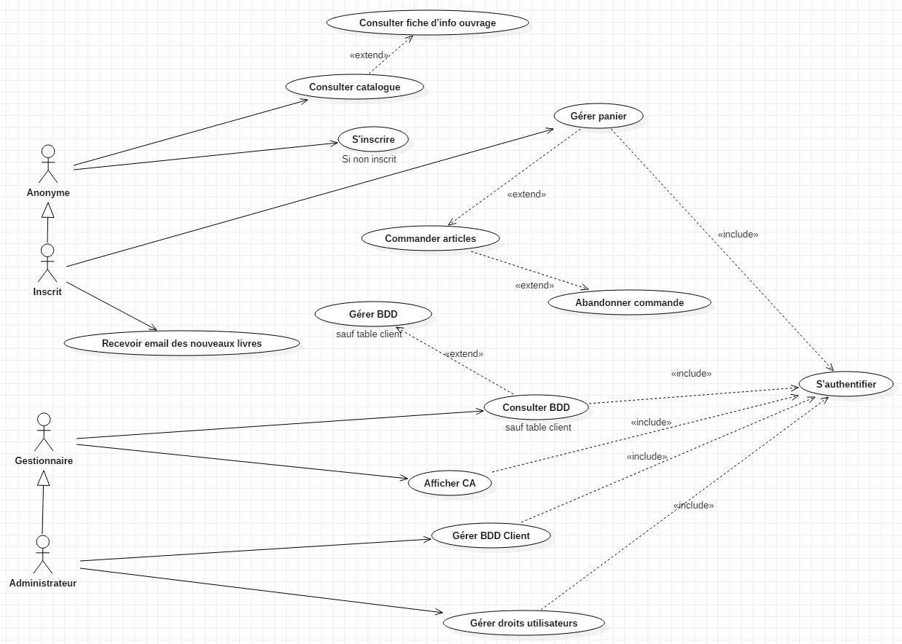

# FilRouge
Nicolas et Cédric
* Trello : https://trello.com/b/MknhZi0a/fil-rouge-livrokaz

# Site e-commerce de vente de livres d’occasion « LivrOkaz »
un site de e-commerce qui permet la
vente de livres d’occasion par un envoi physique (courrier postal) aux clients et le paiement par carte banquaire.

## Taches réalisées :
* Maquettage des pages Web (y compris sur les mobiles)...en cours...
* Le modèle conceptuel des données (MCD).
* Le modèle logique des données (MLD)
* CRUD (microservice) en JSON...en cours...
* Architecture SpringBoot avec les liens @ManyToMany, @ManyToOne...en cours..
* Authentification avec Springboot security.

## Dépendances liées au projet : 

* spring-boot-starter-web
* spring-boot-starter-jdbc
* spring-boot-starter-data-rest
* spring-boot-starter-data-jpa
* spring-boot-starter-security
* spring-boot-starter-thymeleaf
* thymeleaf-extras-springsecurity5
* mysql-connector-java
* jaxb-api
* jquery
* bootstrap
* hibernate-jpa-2.1-api
* maven-ejb-plugin
* spring-data-commons
* spring-boot-devtools

## Uses Cases

