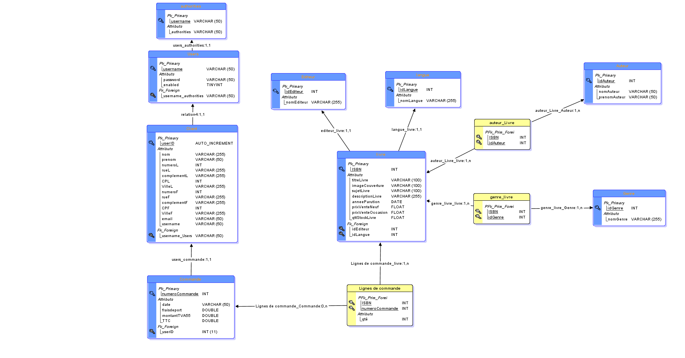
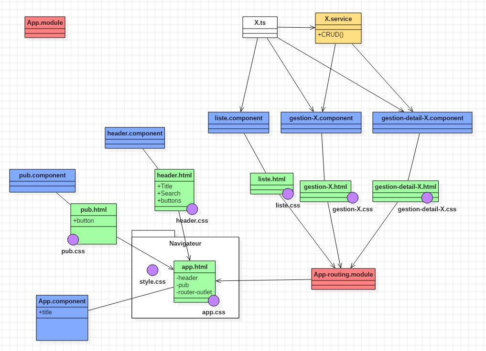

# FilRouge
Nicolas et Cédric
* Trello : https://trello.com/b/MknhZi0a/fil-rouge-livrokaz

# Site e-commerce de vente de livres d’occasion « LivrOkaz »
un site de e-commerce qui permet la
vente de livres d’occasion par un envoi physique (courrier postal) aux clients et le paiement par carte banquaire.

## Taches réalisées :
* Maquettage des pages Web (y compris sur les mobiles)...en cours...
* Le modèle conceptuel des données (MCD).
* Le modèle logique des données (MLD).
* CRUD (microservice) en JSON.
* Architecture SpringBoot avec les liens @ManyToMany, @ManyToOne, @OneToOne.
* Authentification avec Springboot security.
* Front en Angular.
* Gestion des tables de la BDD en front sur le site.

## Dépendances liées au projet : 

* spring-boot-starter-web : Permet de mettre en ligne une application (ici Spring) via un serveur Tomcat.
* spring-boot-starter-jdbc : Dépendance permettant d'utiliser JDBC via Hikari (Qui est un framework dédié aux connexions JDBC).
* spring-boot-starter-data-rest : Permet de distribuer les données JSON.
* spring-boot-starter-data-jpa : Permet d'utiliser JPA via hibernate (potentiellement doublon).
* spring-boot-starter-security : Permet d'implémenter une couche de sécurité.
* spring-boot-starter-thymeleaf : Permet à Spring d'être compatible avec les VUES ThymeLeaf (Template java côté  serveur permettant d'intégrer du code dans les pages HTML). 
* thymeleaf-extras-springsecurity5 : (Permet de rajouter les TAGLIB qui ne sont par défaut pas compatible -> affichage de données en fonction du rôle de l'utilisateur sur une même page).
* mysql-connector-java : Permet de faire la liaison entre une table SQL et une appli JAVA
* jaxb-api : Permet d'utiliser des XML au sein de l'application (certainement doublon avec Hibernate)
* jquery: Webjar(dépendance côté client packagee en .jar) permettant d'utiliser du javaScript.
* bootstrap : Permet d'utiliser les fonctions BootStrap (Bibliothèque CSS, HTML, JS).
* hibernate-jpa-2.1-api : Framework gérant la persistance des objets dans une base de données relationnelle.
* maven-ejb-plugin : Plugin permettant de faire la liaison entre le serveur et le client dans un projet Entreprise Java BEan
* spring-data-commons : https://docs.spring.io/spring-data/commons/docs/current/reference/html/ (à potasser)
* spring-boot-devtools : Redémarre le serveur lors d'une modification de code enregistrée et affiche des infos supplémentaires de débugging.

## Uses Cases

## MLD

## Organisation du front (Angular)

